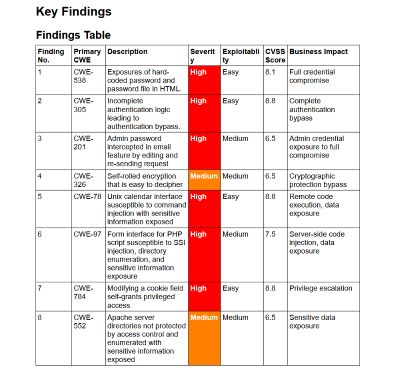

+++
date = '2026-02-09T12:57:12-05:00'
draft = false
tags = ['cybersecurity', 'simulation', 'forage']
title = 'Commonwealth Bank Forage Simulation Part 2'
+++

This portion of the Commonwealth Bank Forage simulation involves some fun, lighthearted pentesting exercises with www.hackthissite.org

## hackthissite
A website that appears to hail from the Myspace days, *hackthissite* offers several tiers of hacking challenges. My final task from Commonwealth Bank is to complete these challenges and compile a mock pentest report with the following components:
- An executive summary
- A scope
- Vulnerability descriptions
- Key findings
- Security recommendations

This involves copious documentation, which is, of course, one of my favorite things. 

Rather than turn this page into a walk-through for these exercises, I'll briefly state the essence of each one.
1. A test of whether you know how to inspect the elements of a webpage.
2. A funny case of broken authentication. While we are to assume the password-checking logic is fine, there's a *missing* component that is required for the logic to perform a valid comparison check, and nothing == nothing, after all.
3. Demonstrates why relying on hidden form fields is insecure.
4. This one requires a little interception.
5. Claiming to be more advanced than problem 4, problem 5 was cracked the exact same way.
6. The sixth problem involves decyphering the scheme of a Caesar-like encryption algorithm.
7. A command injection exercise.
8. A slightly different command injection exercise.
9. Almost exactly the same command injection exercise as in Challenge 8.
10. Tests your literacy of cookies. The challenge mentions "know"ing JavaScript. I suppost that's because it involves JSON, but I initially went into it expecting a scripting exercise.
11. Directory enumeration.

## Conclusion
I compiled my evidence and findings into a mock report.

Handing in this report concludes the simulation. Working through this experience was good, constructive fun. I especially enjoyed Task Three, which required me to make an infographic on good password practices. Big thanks to Forge and Commonwealth Bank for putting these out into the world.

## Related Posts
The current post is the second part of a 2-part series:
- [Part 1](../Commonwealth-Bank-Forage-Simulation/)

