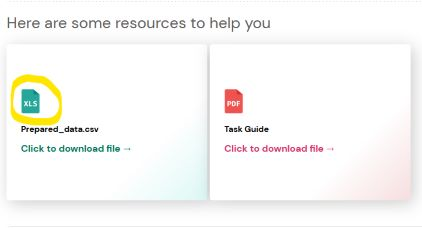
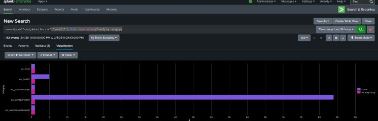
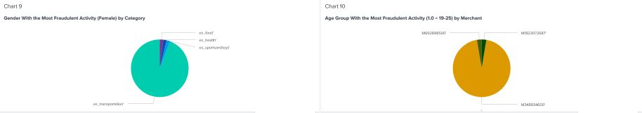
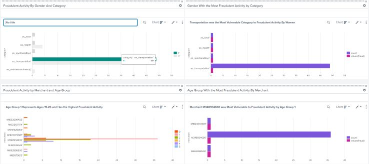
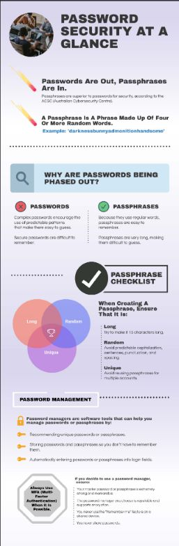

+++
date = '2026-02-05T23:29:00-05:00'
draft = false
tags = ['cybersecurity', 'simulation', 'forage']
title = 'Commonwealth Bank Forage Simulation'
+++

## Task One: Data Visualization
This task involves using **Splunk** for data visualization to inform fraud detection and prevention. It provides a randomly-generated data set of payments with a target variable indicating if each transaction was fraudulent.

This task requires activating Splunk's free trial. I just hope I don't recieve another Splunk task outside of that 60-day window, as it has been said that Cisco bought Splunk because it was cheaper than renewing the license.

### What is Splunk?
Splunk is a platform that collects, indexes, and analyzes data from various sources to power use cases of security, IT operations, and monitoring. To put it concisely, it is a powerful SIEM (Security Information and Event Management) solution.

### Task One Resources
The task provides two resources:
1. A file titled "Prepared_data.csv", which actually downloads a file with a Windows Excel file format instead of a csv.
2. A PDF guide for the task.

The `prepared_data.xslx` resource is a binary file rather than a text file, so it needs to be saved as a `.csv` in MS Excel (or LibreOffice Calc, in my case) before it is fed to Splunk.

The task specifies requisite data visuals in plain English -- For example: I need to make a graphic that represents "Fraud detected by Age". Fulfilling this criteria will require playing with Splunk's data query language (SPL, or Search Processing Language).

### Splunk Data Queries
SPL is Splunk's language for searching, analyzing, transforming, and reporting on high volumes of log-based data. With its combination of commands and pipes, its syntax feels UNIX-like. Conceptually, SPL can be compared to SQL because both languages have potent querying capabilities and are used for pulling useful data and placing it in useful forms. Though, the two operate on different kinds of data and have disparate syntaxes.

Splunk also offers SignalFlow, which is slightly *cooler* (in my opinion) because it is Python-like and facilitates the creation of little programs to work with the data. However cool, SignalFlow is not appropriate for this task because it is meant for streaming data.

The guide seems to want me to use this syntax pattern to obtain visuals for fraud detected by each relevant field:
`sourcetype="<source>" fraud="1" | stats count values(fraud) by <field>`
Filtering for a specific fraud value while asking for a count of distinct fraud values seems redundant, but it can also serve to visually communicate that *only* fraudulent transactions are being represented in the graphic.

I ended up changing some of my work based on the professional example they provided. I removed superfluous charts, adopted a numbering convention, and chose more suitable graphical formats for some of the charts.

### Post Mortem
Two things are left for me to reflect on.
- Effective labeling on a graphic can perhaps replace the need for extra graphics!
- My initial instincts about using certain types of graphics were valid, but I defaulted to bar charts based on what I had read about avoiding pie charts and line graphs. I suppose my instincts were right all along.

## Task Two: Incident Response
Task Two poses a scenario where your colleagues have fallen victim to a phishing attack that deposits ransomware onto their machines.
It asks a few questions about the incident response process and how to apply it to the situation.

## Task Three: Password Security and ACSC (Australian Cyber Security Centre)
This one involves communication with non-technical folks. It's just the sort of thing I love, and no, that's not a joke!

I need to create an infographic that represents key statistics on password security, advice for creating strong passwords, and tips on password management. Because it is for a non-technical audience, clarity, visual appeal, and accessibility are essential.

The ACSC (Australian Cybersecurity Centre) didn't actually have any recent password guidance other than, "switch to passphrases". I've been seeing these mentioned for a few years now. How do we hope to get people to use passphrases when the term doesn't seem to be in the general lexicon? Despite the intuitive benefits of passphrases, I can't remember ever seeing a website (other than a cybersecurity website) ask for or mention one. Forms that validate new passwords according to the *old* guidance favoring complexity have become ubiquitous -- meanwhile, the experts' consensus has shifted away from complexity and towards length. It's like herding cats.

## Related Posts
The current post is the first part of a 2-part series:
- [Part 2]()