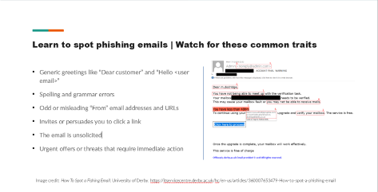

+++
date = '2026-02-15T23:06:51-05:00'
draft = true
title = 'Mastercard Forage Simulation'
tags = ['cybersecurity', 'simulation', 'forage']
+++
This simulation was fairly brief. Rather than go over all of it, I'm going to elaborate on the last task because it required the most effort.

## Phishing Attacks!
Fictional coworkers have been duped by a phishing simulation! With the might of PowerPoint, perhaps they can be educated to spot these attacks in the future.

In the real world, there's no overstating the value of user education.
For this task, I created a short PowerPoint covering the following topics:
- What is phishing?
- How do we spot phishing?
- How do we prevent ourselves from being phished?

The task encouraged creativity, so I inserted what I thought were interesting examples of successful phishing attacks (and a bit of humor).

### The 2014 Sony Attack
Imagine a timeline where state-sponsored terrorists attacked and threatened a major movie company for putting another Seth Rogen weed comedy into the world. It's this timeline. We're in it.
This attack was eventually blamed on North Korean State Actors, though at the time, it smelled like a publicity stunt for Sony's upcoming movie, *The Interview*.

### Love Bug
The prospect of romance over email led 10 million people into compromise when they clicked an attachment in an email headlined with "ILOVEYOU". Being that it was the 2000's, all this malware really did was give your files a nasty haircut before self-replicating. In addition to causing a historical incident, it changed Philipino law.

### 2017 Attacks of Facebook and Google
A guy sent invoices to Facebook and Google for over $100m... ***and they paid him***.

Factual stories ground the subject in reality. They prove there is substance behind measures that can feel like ritual inanity. A touch of organic absurdity (hopefully) glues the awareness training into memory. I'd hope that anyone hearing these cases for the first time would smile or, at least, raise a brow.

## Post Mortem
If I were to redo this project, I'd make the following changes:
1. Split up content: More slides with less text in each one.
2. Add more visuals. It's a cliche for a reason.

