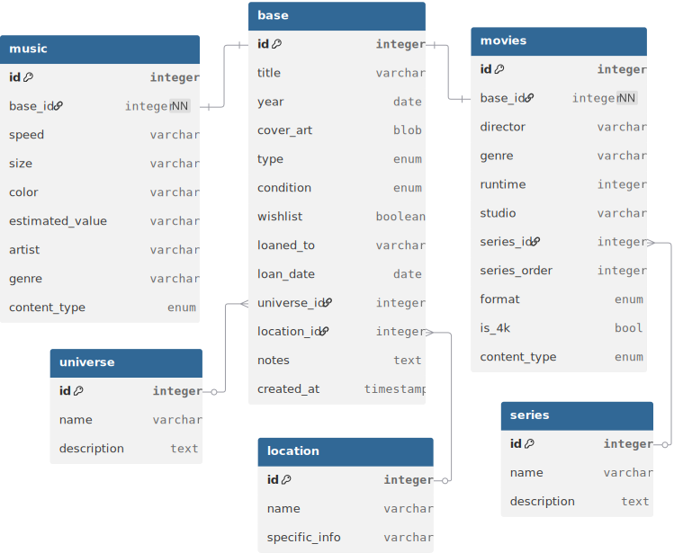
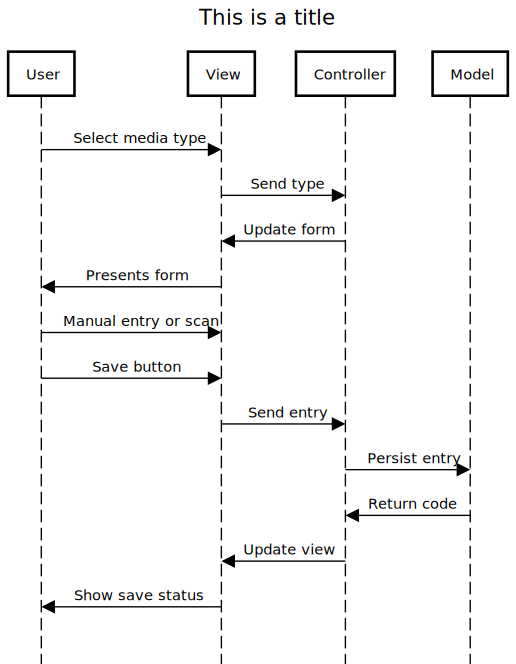

+++
date = '2026-02-24T23:37:00-05:00'
draft = false
title = 'Tauri Media Management App'
tags = ['rust', 'programming']

+++
## Idea
The purpose of this project is to create a self-hosted, unified library of a person's owned physical media (cds, vinyl, dvds and blu-ray).
This comes from watching home-theater/audio enthusiasts struggle to catalog all of the physical media they own and remember where each item is. The go-to solution was an Excel spreadsheet, which sort of works, but isn't query-friendly and gets unweildy as listings grow.

Here's a proper user story:

>As a forgetful home theater enthusiast, I want to document and query my physical media, so that I can avoid purchasing duplicates.

And another:

>As a fastidious home theater enthusiast with a vast collection, I want to document the location of my media, so that I know where all of my media is at all times.

And another:

>As a physical media enthusiast, I want to track and organize my physical media collection in a locally-administered way, so that I can manage my media without opting in to a live service.

I'll circle back to UX/UI concepts *after* handling some more back-end because I find that handling front-end design after back-end is more efficient for me when I work on a full-stack project alone.
## Requirements Gathering
A brief list of design requirements:
- Locally hosted
- Ability to query
- Unified for multiple forms of audio and audio-visual media in one app
- User-friendly UX
- UI that doesn't look like Tailwinds
- Lightweight application
- Portability (can export, and import data in standard formats for exchange between systems and services)
- Metadata that supports querying
- Customizable user-added metadata
- (Optional) API integration to port metadata from external sources

## Database Design
This is the preliminary design for the database. The idea is to compose each media of a base set of universal characteristics plus its type-specific characteristics.



The overarching principle with this design is extensability.

## Entering data
I made this sequence diagram just to have something to reference, though this interaction sequence isn't complex at all


## General plan
The current plan is to focus on features iteratively
1. Foundational
- Basic Tauri app
- SQLite database with schema
- Full manual entry flow
- Basic collection view with search and filter
- Condition and loan tracking
2. Usability
- Export and import
- Tag system
- Wishlist?
- Duplicate detection
- Series and universe
3. Metadata
- Possible api integration?
4. Power features
- Barcode scanning
- Bulk import
- Statistics dashboard
- Values for vinyl?

## Tauri Project Structure
Claude drafted this up for me and I'm keeping it for my records.

```goat
media-vault/          ← whatever you want to call the app
├── src-tauri/        ← everything Rust lives here
│   ├── src/
│   │   ├── main.rs           ← Tauri app entry point
│   │   ├── db/               ← database layer
│   │   │   ├── mod.rs
│   │   │   ├── schema.rs     ← table definitions
│   │   │   └── migrations/   ← SQL migration files
│   │   ├── models/           ← your structs (Media, Vinyl, Movie etc.)
│   │   │   └── mod.rs
│   │   ├── commands/         ← your Tauri command functions
│   │   │   └── mod.rs
│   │   └── errors.rs         ← shared error types
│   └── Cargo.toml            ← Rust dependencies
└── src/                      ← Angular app lives here
    ├── app/
    │   ├── core/             ← services, models, guards
    │   ├── features/         ← collection, entry, wishlist etc.
    │   └── shared/           ← reusable components
```
Notes to self:
- The "migrations" folder allows a schema to evolve over time by adding new migration files.
- The "commands" folder can be used to implement features via tauri commands. Ex: CRUD, search, filtering, exporting, etc. Commands should do as little logic as possible, calling into data query layers. Commands should also have robust error handling.
- The "features" folder is a good place to put the main sections.

## Rust Backend Layers:
```goat
.----------.
| Commands | <- Calls database layer.
.----------.
| Db/query | <- Functions that return model structs. (Sqlx)
.----------.
| Models   | <- Structs that mirror tables
.----------.
| Schema   | <- Raw SQL (sqlite)
.----------.
```
This is an ongoing project. New information will be added as it develops!

